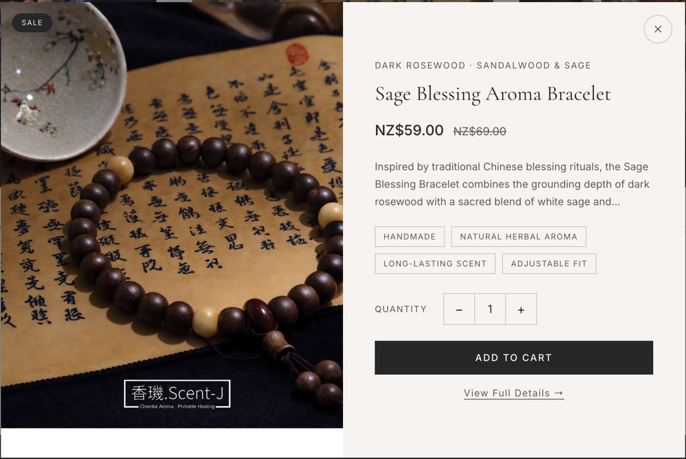

# Scent-Ji

An e-commerce website for aromatherapy products with a focus on brand presentation and user experience.

## Live Demo

🔗 [View Live Site](https://scent-ji.vercel.app)

## Overview

Scent-Ji is an e-commerce website designed for browsing and purchasing aromatherapy products. The project focuses on creating a visually consistent shopping experience with product showcases, interactive browsing features, and a responsive design that works across devices.

**Project Type:** E-commerce Website

## Tech Stack

**Frontend:**
- React
- React Router
- Vite
- CSS

**Backend:**
- Supabase (authentication and database)

**Deployment:**
- Vercel

## Key Features

- Product browsing with collection pages
- Interactive quick-view modals for products
- Shopping cart with quantity management
- User authentication and account management
- Checkout flow with order summary
- Responsive design for mobile and desktop
- Wellness content section

## Screenshots

### Homepage
The landing page features a clean hero section with brand identity, navigation menu, and featured product imagery.


### Product Collection Grid
Product browsing interface displaying aromatherapy items with images, names, and pricing in a responsive grid layout.


### Quick View Modal
Interactive product quick view modal allowing users to see product details, select quantity, and add items to cart without leaving the current page.



## Project Structure

```
scent-ji/
├── src/
│   ├── components/       # Reusable UI components
│   ├── pages/           # Route components
│   ├── context/         # State management
│   ├── hooks/           # Custom React hooks
│   ├── data/            # Product data
│   └── lib/             # Utilities
├── public/              # Static assets
└── screenshots/         # Documentation images
```

## Installation and Setup

### Prerequisites
- Node.js
- Supabase account

### Local Development

1. **Clone the repository**
   ```bash
   git clone https://github.com/zj115/scent-ji.git
   cd scent-ji
   ```

2. **Install dependencies**
   ```bash
   npm install
   ```

3. **Set up Supabase**
   - Create a new project at [supabase.com](https://supabase.com)
   - Run the SQL schema from `supabase-schema.sql` in the Supabase SQL Editor
   - See `SUPABASE_SETUP.md` for detailed instructions

4. **Configure environment variables**
   - Copy `.env.example` to `.env`
   - Add your Supabase credentials:
     ```
     VITE_SUPABASE_URL=your_supabase_project_url
     VITE_SUPABASE_ANON_KEY=your_supabase_anon_key
     ```

5. **Run the development server**
   ```bash
   npm run dev
   ```

## My Contribution

I built this project to demonstrate frontend development skills with a focus on e-commerce user experience. My work included:

- Designed and implemented a responsive e-commerce UI with React and CSS
- Built reusable components for product cards, modals, and navigation
- Implemented shopping cart functionality and checkout flow
- Integrated Supabase for user authentication and order management
- Created a component-based architecture for maintainability
- Deployed the application to Vercel

## Security and Privacy

- All credentials are managed through environment variables
- No API keys or database credentials are committed to the repository
- User data is protected with Supabase row-level security policies
- This repository is shared for portfolio purposes with business details removed for privacy

## Notes

This repository is shared for portfolio and demonstration purposes. The project demonstrates my ability to build a functional e-commerce website with modern web technologies.

## License

This repository is shared for portfolio and demonstration purposes only.
